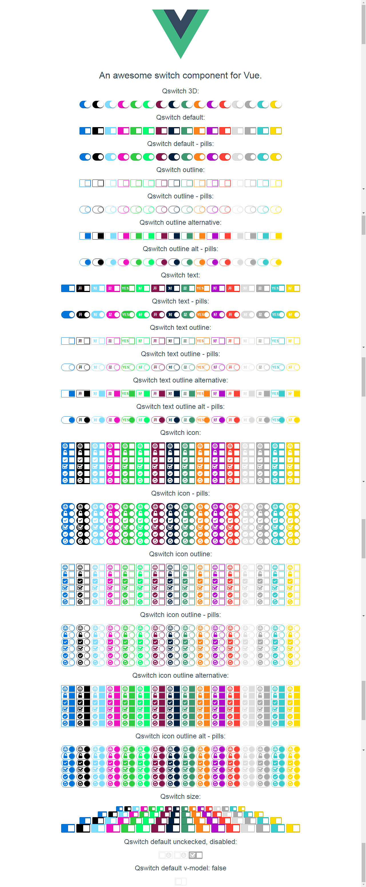

# Qswitch

> An awesome switch component for Vue.（一个帅气的Vue开关组件。）

## Build Setup（构建安装）

``` bash
# Before doing so, make sure Vue(>2.2) is installed correctly.（在此之前，请确保Vue(>2.2)已正确安装。）
# install Qswitch for your project.（为你的项目安装Qswitch。）
npm install qswitch --save
```

## Import（导入组件）

``` js
import Qswitch from 'path/to/Qswitch'
Vue.use(Qwsitch)
```

## Usage

> In order to achieve twoway binding, must set  the `v-model` attribute  for Qswitch. （为了实现双向绑定，必须设置`v-model`属性。）

``` html
<div>
	<h2>Qswitch default v-model: {{ ref_to_checked }}</h2>
	<qswitch v-model="ref_to_checked" :value="val"></qswitch>
</div>
```

``` js
  import Qswitch from './components/Qswitch.vue'

  export default {
    name: 'app',
    data() {
      return {
        msg: 'An awesome switch component for Vue.',
        val: 'I am value',
        ref_to_checked: false
      }
    },
    components: {
      'qswitch': Qswitch
    }
  }
```



[Demo.（请看实际例子。）](example/demo.html "Demo.（请看实际例子。）")

> [font awesome](http://fontawesome.io/icons/ "font awesome") is required in order to dispaly icon for Qswitch.（需要 [font awesome](http://fontawesome.io/icons/ "font awesome")才能显示Qswitch的图标。）

## Properties（属性）

| Name（名称） | Type（类型） | Default（默认值） | Description（描述）|
| ---------- | ----------- | ---------------- | --------------- |
| name       | String（字符串） |               | The `name` attribute of the `<input type="checkbox" />` element in the Qswitch componnent.（Qswitch组件中`<input type ="checkbox"/>`元素的`name`属性的值。）|
| value      | String（字符串） | `false`         | The `value` attribute of the `<input type="checkbox" />` element in the Qswitch componnent.（Qswitch组件中`<input type ="checkbox"/>`元素的`value`属性的值。）|
| checked    | Boolean（布尔）  | `false`         | The `checked` attribute of the `<input type="checkbox" />` element in the Qswitch componnent.（Qswitch组件中`<input type ="checkbox"/>`元素的`checked`属性的值。）|
| type       | String（字符串）  | `default`      | The type of Qswitch componnent, allow values: `default` ， `text` ， `icon` and `3d`.（Qswitch组件的类型，允许值为：`default` 、 `text` 、 `icon` 、 `3d`。）|
| size       | String（字符串）  | `default`      | The size of Qswitch componnent, allow values: `default` ， `mini` ， `small` and `big`.（Qswitch组件的大小，允许值为：`default` 、 `mini` 、 `small` 、 `big`。）|
| icon       | String（字符串）  |                | The icon of Qswitch componnent, allow values: `happy` ， `lock` ， `check` ， `check2` ， `check3` and `check4`.（Qswitch组件的图标，允许值为：`happy` 、 `lock` 、 `check` 、 `check2` 、 `check3` 、 `check4`。）|
| color      | String（字符串）  | `blue`         | The color of Qswitch componnent, allow values: `black` ， `aqua` ， `blue` ， `fuchsia` ， `green` , `lime`,  `maroon` ， `navy` ， `olive` ， `orange` ， `purple` , `red` ， `silver` ， `gray` ， `teal` and `yellow`.（Qswitch组件的颜色，允许值为：`black` 、 `aqua` 、 `blue` 、 `fuchsia` 、 `green` 、 `lime`、  `maroon` 、 `navy` 、 `olive` 、 `orange` 、 `purple` 、 `red` 、 `silver` 、 `gray` 、 `teal` 、`yellow`。）|
| pill       | Boolean（布尔）  | `false`         | The Qswitch componnent dispaly as a pill shape.（Qswitch组件已胶囊形状显示。）|
| outline    | Boolean（布尔）  | `false`         | The Qswitch componnent dispaly as an outline shape.（Qswitch组件已轮廓形状显示。）|
| alt        | Boolean（布尔）  | `false`         | The Qswitch componnent dispaly as the default but outline shape.（Qswitch组件已默认加轮廓形状显示。）|
| text_on    | String（字符串）  |                | The text of the Qswitch componnent when it is on. Only valid when `type` is` `text`.（Qswitch组件处于开启状态时显示的文字。只有在`type`为`text`的时候有效。）|
| text_off   | String（字符串）  |                | The text of the Qswitch componnent when it is off. Only valid when `type` is` `text`.（Qswitch组件处于关闭状态时显示的文字。只有在`type`为`text`的时候有效。）|

## Donate（赞助）


